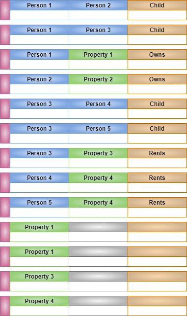
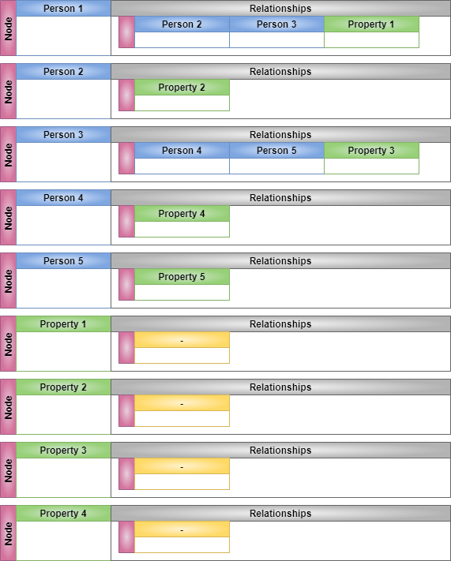
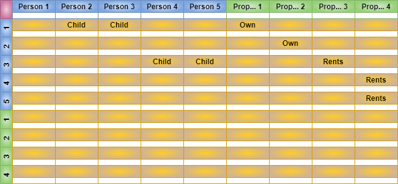

# Graph implementations

Graphs implemented in a way that works for <https://pub.dev/packages/graphs> hosted on [dart-lang-tools on GitHub](https://github.com/dart-lang/tools/tree/main/pkgs/graphs)

## Graph Types

...for some definition of "implemented"

* [Adjacency Matrix](https://en.wikipedia.org/wiki/Adjacency_matrix)
* [Adjacency List](https://en.wikipedia.org/wiki/Adjacency_list)
* [Edge List](https://en.wikipedia.org/wiki/Edge_list)

### Possible future graph types

* [Incidence Matrix](https://en.wikipedia.org/wiki/Incidence_matrix)

## Graph Implementations

This currently implements weak sauce versions of the following models. All of the implementations support generics so that you can use your own `Node` and `Edge` implementations.

Simple `Node<T>`  and `Edge<N>` are provided.  They let you put data on your node or edge.  The latter is useful if you wanted something like weights on edges.

| Implementation | Class| Directed _edges_ | Undirected _edges_ | Multiple _edges_[1] | Edge data[2] | Notes|
| - | - | - | - | - | - | - |
| Adjacency List | DirectedGraphAdjacencyList | Yes | Slow | Yes [3] | No |  This is a denormalized directed graph representation _by design_.  |
| Adjacency Matrix | AdjacencyMatrix | Yes | Yes | No | Yes [5] | This is a matrix graph representation.  Edges can be added as directed or undirected.   |
| Edge List | DirectedGraphEdgeList | Yes | Slow | Yes [4] |  Yes [5] | This is a normalized graph representation. |
| Edge List | UndirectionalGraphEdgeList | Yes | Yes | Yes [4] | Yes [5] | This is a normalized graph representation where all the edges are treated as bi-directional. |

Notes

1. Multiple edges means multiple edges are supported between two nodes
1. Data can be stored on the edge itself
1. Reverse direction only.
1. Must be of different generic types.  `DirectedGraphEdge<Owner>` and `DirectedGraphEdge<Renter>`.  These still support your custom node types or arbitratrary edge data.
1. Edges data can be of different types

### Directional Edges

Some of the graph storage implementations lend themselves to directed graphs. They support reverse or nondirected edges functions in inefficient manners.  Some of this can be overcome by adding two edges, one in each direction.

Some of the graph storage implementations are hard wired to be _undirected_.  They don't actually support one way _directed_ graphs.

### Example Graph

The example graph has two node types, _Person_ and _Property_ and two relation types, one _person-to-person_ and one _person-to-property_.

None of the graph implementations implement Node/Relationship restrictions.

#### Edge List

#### Adjacency List

Adjacency List does not retain any relationship _type_

#### Adjacency Matrix

#### Video

A video walkthrough  

## Additional information

### General graph references

* [Graph discrete mathematics](https://en.wikipedia.org/wiki/Graph_(discrete_mathematics))
* [Directed Graphs](https://en.wikipedia.org/wiki/Directed_graph)

### Dart references on algorithms

* [Data Structures and Algorithms 5/5 by Al-Shahmeh](https://medium.com/@m.m.shahmeh/data-structures-algorithms-in-dart-5-5-660e0ef30a4d)

### Algorithms I wish the Dart team would implement

* [Stoer Wagner algorithm](https://en.wikipedia.org/wiki/Stoer%E2%80%93Wagner_algorithm)
